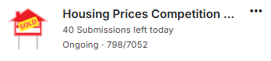

# 📈 Linear Regression Using NumPy

This project implements Linear Regression from scratch using only NumPy. It demonstrates how to fit a linear model to data using both the **ADAM optimizer**.

## 📖 Overview 
- Implementation time: 10/03/2025 - 16/03/2025
- Competition link: [Here](https://www.kaggle.com/competitions/home-data-for-ml-course)

## ⭐ Features

- Implements Linear Regression without using machine learning libraries.  
- Supports **Adam** for optimization.  
- Generate submission file for the competition.

## 🔧 Installation

### Requirements

Ensure you have Python and the necessary libraries installed:

```bash
pip install -r requirements.txt
```

## 🚀 Usage

1. Open the Jupyter Notebook (`.ipynb` file).
2. Run each cell sequentially to:
   - Load and preprocess data.  
   - Implement and test Adam optimizer. 

## 🛠️ Implementation Details

- **Gradient Descent:** Iteratively updates model parameters to minimize loss.  
- **Normal Equation:** Computes the optimal weights directly using a mathematical formula.  
- **Loss Function:** Mean Absolute Error (MAE) is used to evaluate model performance.  

## 📊 Results

Recorded: 16/03/2025  


## 👤 Author

Vo Nguyen Phat

## 📜 License

This project is open-source and available under the MIT License.
