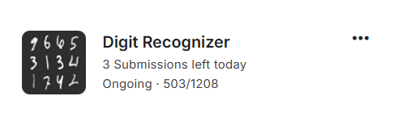

# 📈 Neural Network for image classification using Multi-layer Perceptron

This project implements **Logistic Regression** from scratch using only **NumPy**. It demonstrates how to fit a logistic model to data using the **Adam optimizer**.

## 📖 Overview
- **Competition link:** [Here](https://www.kaggle.com/competitions/digit-recognizer/data) (Please refer to this link for information about dataset)

## ⭐ Features

- Implements **Neural Netowrk** using Multi-layer Perceptron.  
- Supports **Rectified Adam** for optimization.  
- Generates a submission file for the competition.

## 🔧 Installation

### Requirements

Ensure you have Python and the necessary libraries installed:

```bash
pip install -r requirements.txt
```

## 🚀 Usage

1. Open the Jupyter Notebook (`.ipynb` file).
2. Run each cell sequentially to:
   - Load and preprocess data.  
   - Implement and test **Logistic Regression** with **Adam optimizer**.

## 🛠️ Implementation Details

- **Adam Optimizer:** Iteratively updates model parameters to minimize loss.  
- **Loss Function:** Cross-Entropy is used to evaluate model performance.  

## 📊 Results



## 👤 Author

Vo Nguyen Phat

## 📜 License

This project is open-source and available under the MIT License.

